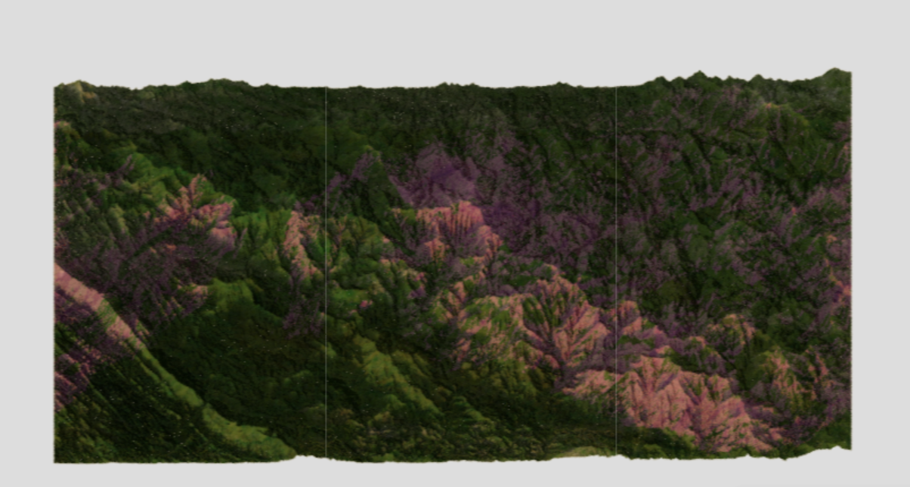

# Sunrise
Sunrise is a RAAS (Rendering As A Service) that displays a 3D Map of the Great Smoky Mountains National Park with information of species concentration of different species.
- 

## Getting Started
Run these commands: 
- `./go.sh docker --dev build`
- `./go.sh docker --dev start`
- `./go.sh --docker virtualenv create`
- `./go.sh --docker virtualenv install`
These commands will setup a docker container, and install some packages for it.

NOTE:       
Make sure that your repository is in a directory named `src` in your home directory.
Also make sure to either have access to the Seelab nas, your own nas, or some other place for large storage. If you are running this on a Seelab machine, you should likely create a directory for this on the nas and symlink it to a folder named `data` in the repo location.

### Preprocessing Data
Before running the server, we need to do some processing on the data to create some geometry. To do this, there are a number of jupyter notebooks that perform the necessary transformations to create valid data for us to use.

Run the notebook titled *Sunrise - Preprocess Geographic Tile Data.ipynb*. To run this notebook, make sure that you have run the commands above. If there are packages that are not installed, make sure to install them as those issues arise.

### Rendering Data
After running the previous notebook, we have 1 more to run. This one is named *'Sunrise - Render Preprocessed data.ipynb'*

After running this notebook, run the command `./go.sh server` and go to the port that it specifies that it is listening on. You should now be able to see the current demo!

RAY TRACED DEMO EXAMPLES:
- [1](http://jpngfile.com/CS488-Website/)
